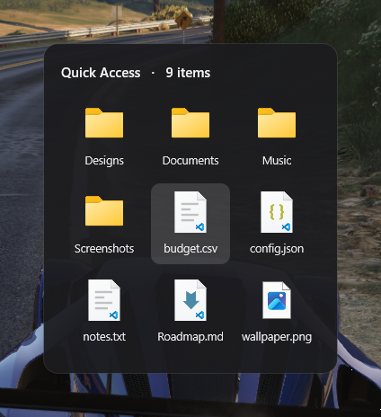

# doludock

> Hold **WIN + Space** to peek at a folder's contents over any window.

[](LICENSE)


`doludock` sits in the system tray. Hold **`WIN + Space`** to fade in a translucent
panel showing a folder's contents over whatever you're doing; release to dismiss.
Click an item to open it.



## Features

- **Hold-to-peek** — reveal while the shortcut is held (or toggle on / off), dismiss on release.
- **Always on top** — draws above everything, including the Start menu and taskbar.
- **Native** — real Windows icons and Explorer-accurate names.
- **Crisp & light** — GPU-rendered with Direct2D, acrylic backdrop, per-monitor DPI aware, one tiny exe.
- **Stays out of the way** — a single instance only (re-launching just opens settings), icons load in the background so the UI never blocks.
- **Configurable** — shortcut, hold/toggle, folder, layout, header, backdrop and start-with-Windows, all from a settings window; remembered across restarts.

## Download

Grab the latest **`doludock-x.y.z-setup.exe`** from the
[**Releases**](https://github.com/DoluTattoo/doludock/releases) page — a one-click
installer (Start-menu shortcut, optional desktop icon and start-with-Windows, clean
uninstall). Once installed, doludock checks for updates on launch and can install
them for you (toggle it, or check on demand, in **Settings → Updates**).

Windows 10 / 11, 64-bit. The app is unsigned, so SmartScreen may warn on first run
(*More info → Run anyway*).

## Build

From a **Developer PowerShell for VS** (MSVC toolchain on `PATH`), with [CMake](https://cmake.org/) ≥ 3.21:

```powershell
cmake --preset default
cmake --build --preset default
```

The executable is produced at `build/doludock.exe`.

## Usage

1. Run `doludock.exe` — it appears in the system tray.
2. **Hold `WIN + Space`** (the default shortcut) to reveal the folder; release to hide it.
3. **Left-click** an item to open it; **right-click** the panel to dismiss it.
4. **Double-click the tray icon** to open settings, or **right-click** it for *Settings* / *Close*.

The settings window lets you change the shortcut, switch to toggle mode, pick the folder,
set the grid (columns / rows) and where the panel opens (horizontal / vertical offset),
toggle the folder name / item count in the header, choose the backdrop, opacity and rounded
corners, decide whether the cursor recenters on the panel, and start doludock automatically
when you sign in. It is fully keyboard-navigable and scrolls on small screens. Everything is
remembered across launches (the folder defaults to your Desktop).

## License

[GPL-3.0-or-later](LICENSE).
